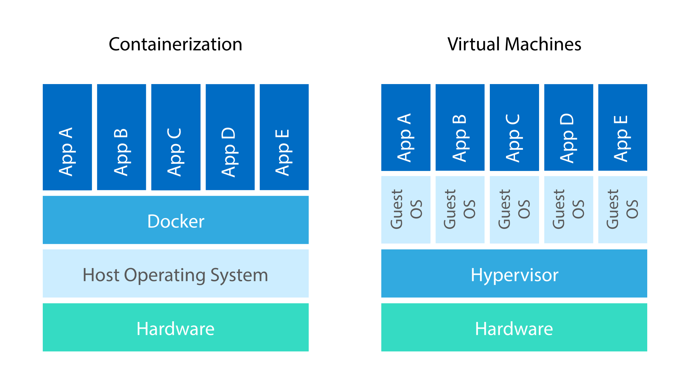
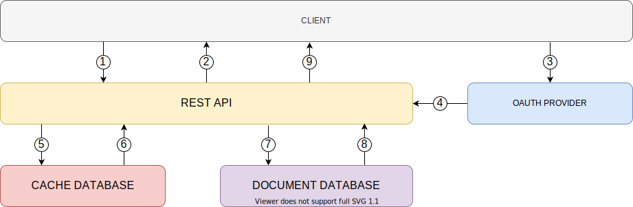
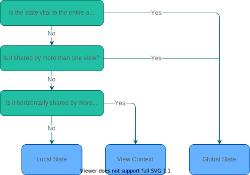
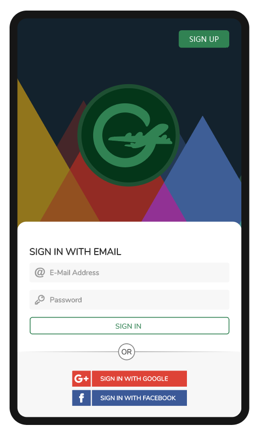
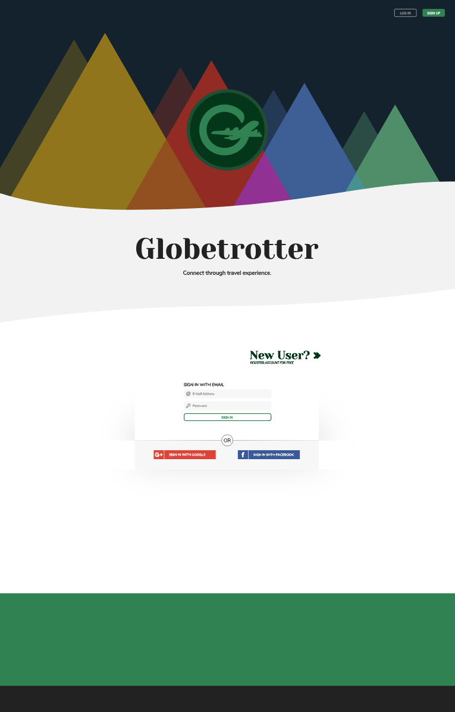
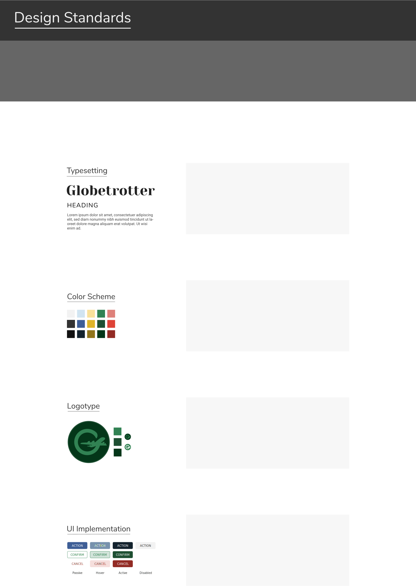

<!-- omit in toc -->
Globetrotter
============

[Hampus Olsen](https://github.com/hampusolsen) 
[EC Utbildning](https://www.ecutbildning.se/) 
Frontend Development, 2020 
Final Examinations Project, 40 YHP

 
 
 
 
 
 

  

 
 

<!-- omit in toc -->
Abstract
--------

 

Globetrotter aims to be a fully functional user-driven travel diary. A web application enabling friends and family to share travel experiences. The application will mainly be divided into two views: one full screen map view for easy travel representation and one blog view for further reading.

 
 

<!-- omit in toc -->
Table of Contents
-----------------

+ [Figure Contents](#figure-contents)
+ [Purpose and Goal](#purpose-and-goal)
+ [Scope](#scope)
  + [Limitations](#limitations)
    + [Responsive Design](#responsive-design)
    + [I18n, A11y and L10n](#i18n-a11y-and-l10n)
    + [Testing](#testing)
  + [Methodology](#methodology)
+ [Strategy and Implementation](#strategy-and-implementation)
  + [The Design Pattern](#the-design-pattern)
  + [Version Control with Git](#version-control-with-git)
  + [Setting up the Workspace](#setting-up-the-workspace)
    + [Configuring the Frontend](#configuring-the-frontend)
    + [Containerization](#containerization)
  + [Documentation](#documentation)
  + [Database Management](#database-management)
    + [Caching Data](#caching-data)
    + [Distributed and Document-based](#distributed-and-document-based)
  + [Authentication and Authorization](#authentication-and-authorization)
    + [Honorable Mentions](#honorable-mentions)
    + [Stateful and Stateless Web Services](#stateful-and-stateless-web-services)
  + [Authentication Flow](#authentication-flow)
  + [Responsive User Interface](#responsive-user-interface)
  + [State Management](#state-management)
+ [Discussion](#discussion)
+ [Conclusion](#conclusion)
+ [Technical Specification](#technical-specification)
  + [Frontend](#frontend)
  + [Backend](#backend)
  + [Testing and Style Enforcement](#testing-and-style-enforcement)
  + [Documentation, Diagrams and Graphics](#documentation-diagrams-and-graphics)
+ [API & Database Specifications](#api--database-specifications)
  + [E/R-diagram](#er-diagram)
  + [Documentation](#documentation-1)
+ [Addendum](#addendum)
  + [Gantt Schedule](#gantt-schedule)
  + [Mockups and Styleguide](#mockups-and-styleguide)

 

<!--omit in toc  -->
Figure Contents
---------------
+ [Fig 1. The structural difference between using containers versus virtual machines](#fig-1.-the-structural-difference-between-using-containers-versus-virtual-machines)

 
 

Purpose and Goal
----------------
 

During the year that has lapsed I have learned a great deal. Many hours were invested into not only course material, but also looking into and implementing anything hastily mentioned by both of our wonderful lecturers Viktor Silfverström and Andreas Argelius. So I really feel like I have gotten a good grasp on how the various parts of a web application works *in isolation*.

That is why I, in this project, have chosen to not only immerse myself in a cog or spring that drive a machine, but instead attempt to deeply understand it as a whole. Everything from a user's first impression to the very last row of a database. I want to make it run and know that I truely am in control of everything. Fully aware of what is lacking, and sure that these are conscious decisions made due to the limitations in place.

 

[*To the top*](#table-of-contents)

 
 

Scope
-----
 

### Limitations
Due to the ambitious nature of the project as well as taking into consideration the practical tone of our school, the project scope is limited by focusing mainly on writing the web application. Obviously the report will mirror this decision. Alas, its functionality will be to describe the project, in detail, more so than act as a typical scientific report.

 

#### Responsive Design
The goal was always to make Globetrotter's UI responsive and largely customized for the most common breakpoints in a *small/medium/large* fashion, albeit taking a mobile-first approach and placing the rest in the backlog on a low priority.

 

#### I18n, A11y and L10n
*Accessibility* is widely overlooked to avoid unneccessary complexity, but has been kept in mind in regards to using semantic HTML elements and preparations were made to ease future implementation. Further, *internationalization* has been limited by only using English as the project language and *localization* set to American English; all documentation, code comments and theory is written as such, though dates are localized.

 

#### Testing
A subject in itself, tests do not to cover any desirable amount of the code base, and those written are simpler integration and unit tests for the frontend client. Initial wishful thinking consisted of a much more test-driven development, but was later discarded due to lack of practical experience. Specifically with regards to end-to-end tests.

 

[*To the top*](#table-of-contents)

 
 

### Methodology
Doing a fullstack project like this, planning it all out sometimes felt overwhelming or stressful and it was close to impossible knowing if everything got covered. Realistically, the planning phase of a project can often be more long-lived than implemention and testing combined. Not something that I could afford, all things considered.

While contemplating my work process I started with tasks that I knew would be of aid during development and demanding no prerequisite work. Such as defining a design styleguide, creating mockups and wireframes as well as E/R and auth flow-schematics. With these things in place it was much easier to produce code. Notes were continuously kept as the codebase grew in size and complexity, and could later be used as fallbacks when writing the project description.

 

[*To the top*](#table-of-contents)

 
 

Strategy and Implementation
---------------------------
 

### The Design Pattern
The [*Model-View-Controller* pattern](https://www.codecademy.com/articles/mvc) is currently dominating fullstack web applications' architecture and it is becoming increasingly hard to find frameworks not building upon this concept. With its fairly simplistic approach that invites to a logical organization of a projects file structure, it is no wonder that the pattern is widely used. Understanding how the different parts work together is, as hinted at, relatively easy, and so in turn also eases development as functionality is clearly defined. For this project the backend provides both model and controller functionality by Mongoose models and route handlers respectively while the frontend, powered by React, acts as the view layer.

 

[*To the top*](#table-of-contents)

 
 

### Version Control with Git
Managing a codebase and tracking development proceedings manually would be an unthinkable feat if it were not for source-code management systems like Git or Subversion. Plenty of hosting platforms exists which allows you to work with Git, such as Bitbucket, GitLab and GitHub to name a few, and since GitHub is both free to use, easy to set up and I already had an account, it made my choice very easy.

Working on a project by yourself and using Git felt at first awkward; since I was developing on my own there was no one else that depended on my commits, and as such there were never any real need to push code to GitHub. So to overcome this awkwardness I just had to follow through on a workflow, just as if the application were developed by a team. Researching different methods, I quickly decided on a [feature branch workflow](https://www.atlassian.com/git/tutorials/comparing-workflows/feature-branch-workflow). This means that development is done on branches secluded from the main trunk, to ultimately be merged after reviewing and testing. Another popular method that I first thought of using was rebasing to get a linear history of project commits; [convinced by Fredrik Morken](https://medium.com/@fredrikmorken/why-you-should-stop-using-git-rebase-5552bee4fed1) that this was purely done in vanity and even opened up to possibilities of complicating tracking of bugs, striving for a linear history felt silly and thus was discarded.

With a workflow in place, and [using conventional commits](https://www.conventionalcommits.org/en/v1.0.0/#summary) that are easily readable by both humans and machines, it was just a matter of consistently conforming to it. Formatting commit messages like this could help greatly during continuous integration and deployment (CI/CD), enabling versioning to be largely automatically documented.

 

*Example of a commit message formatted by conventional commit rules*

    feature(map): Adds controller for retrieving positional data based on coordinates

 

[*To the top*](#table-of-contents)

 
 

### Setting up the Workspace
A project workspace can be configured endlessly, so it is of importance to configure purposefully, and not just because it is possible. Some things requires configuration to work at all while a lot of what is used usually comes with defaults. Globetrotters frontend, for example, utilizes the `create-react-app` script along with its `--typescript` flag which [provides a plethora of default configurations](https://github.com/facebook/create-react-app) needed to start coding. While you could be tempted to start writing code after letting the script finish, it has really just exempted us from doing any groundwork. `create-react-app` not only sets up tons of build tool dependencies, development server with hot reloading and a service worker, it also hides all this away. Which is great for beginner and intermediate development, but is frowned upon and considered bloated by more experienced developers and architects as it comes at the cost of control along with dependencies you might never employ.

 

#### Configuring the Frontend
The next step was to install the [package dependencies selected specifically for Globetrotter](#frontend). Tools I had deemed helpful, though not neccessary, and would increase quality of life during project progression. Because the Globetrotter frontend is written in TypeScript, I also had to install each package's type definitions, were they not included.

Continuing, I administered configuration files for the text editor, code formatter, style enforcer and TypeScript according to [airbnb's famous standards](https://www.npmjs.com/package/eslint-config-airbnb), overwriting some of their rules as I disagreed with them. Such as enforcing default exports in files with a single export. An annoying rule, because often there would be more exports added further down the line. *Rules are made to be broken*, the saying goes.

Setup was finalized by adding configuration files for Git, `.gitignore` and `.gitattributes`, dictating which files to ignore and how files should be interpreted, as well as placing environment variables containing the key enabling the Google Maps API and the URL to my backend.

 

#### Containerization
Globetrotter's backend consists of more than merely a single server providing endpoints for a REST API; a network of servers are working together to store, process and deliver the data that drives the frontend application. With code essential only to the various parts of the backend, it is unneccessary to clutter ones computer by installing these dependancies globally. More often than not, dependencies versions varies between projects because they are rarely kept up-to-date, and neither should they needlessly be. Maintaining a project that requires perpetual support of keeping updated dependencies is simply not a viable strategy. Not for technical reasons and certainly not for financial ones. 

So, to keep ones development machine lean and stripped of non-vital code, we have the option of isolating our local development environments. Accomplishing quarantined conditions can be achieved in several ways, but two of the most common ways are by using either virtual machines or containers. Both methods have their advantages and can even be used in unison. [Containerization was modernized in 2013](https://www.ibm.com/cloud/blog/containers-vs-vms) by the introduction of Docker and has since then gained more and more traction due to its attractive qualities pertaining to cloud computing. Docker has become quintessential for horizontal scaling and microservice architecture.

 

  
  
   
  <em>Fig 1. The structural difference between using containers versus virtual machines.</em>

 

A containerized solution uses very lightweight image descriptions to spin up their respective environment. The image file will tell Docker exactly what the application container needs to be able to do its job. Nothing else. To handle communication between containers, Docker grants the ability to create enclosed networks in which a container can be appointed a member of. It is this communicative attribute that paved way for Dockers explosively increased usage, and allows its users to spin up an entire ecosystem of servers with a single command.

 

[*To the top*](#table-of-contents)

 
 

### Documentation
In an effort to make the task of writing documentation not so overwhelming, I believed it to be a good idea to spread it throughout the projects duration. Documenting functions and data structures close before or after their creation helps with keeping the documentation correct as well as easy and fast to write. Usually technical documentation tends to be automatically generated by tools such as [Swagger](https://swagger.io/), but as I possessed no prior knowledge of their utilization and already felt as if there were enough things to consider, adding another tool and also learning how to use it  was out of the question.

After having read so much documentation on Github and elsewhere I knew I could not possibly write my own in any other syntax than *[Markdown](https://en.wikipedia.org/wiki/Markdown)*, even though *[reStructuredText](https://en.wikipedia.org/wiki/ReStructuredText)* is a solid contender and widely used; picking anything else would feel like committing a crime.

To accomodate the widest array of platforms and pursuit the highest percentage of compatibility I found the [commonmark specification](https://spec.commonmark.org/0.29/) to align closest with my writing style while achieving these goals. So I have followed their syntax guidelines while writing this report, only deviating when it comes to commenting, where I found [an interesting stackoverflow post](https://stackoverflow.com/questions/4823468/comments-in-markdown/32190021#32190021), proving `[comment]: # (<comment here>)` with an empty line above, to provide best platform coverage.

 

[*To the top*](#table-of-contents)

 
 

### Database Management
Content

 

#### Caching Data
Content

 

#### Distributed and Document-based
Content

 

[*To the top*](#table-of-contents)

 
 

### Authentication and Authorization
A collectively deemed complex and persistant subject of debate is the topic of how to handle authentication of users. Without a method of identification there would be no way to personalize the user experience, and without verification of identity, neither would there be a way to secure it.

Before even beginning to write about authentication and authorization, we must first clearly define both terms. More often than not they are swapped around or used semantically indistinguishable from oneanother although there is a clear cut difference:

+ **Authentication** equals *verifying identity*, such as when a user provides a combination of an e-mail address and a password.

+ **Authorizing** means *granting access* to a restricted resource or method, like granting access to a sectioned off part of a website or allowing someone to read and write to a database.

 

    “Encryption works ... Unfortunately, endpoint security is so terrifically weak ...”

*[Edward Snowden](https://twitter.com/snowden)*

 

Handling user data in a safe and responsible manner has been proven to be very difficult and is a task with many ways to fail. Having spent days upon days searching for a surefire way as to how authentication should be implemented, I was forced to forfeit in favor of preserving time. There is no holy grail of authentication and the methods available are continuously changing.

Though myself and Mr. Snowden just might have implied that no one seems to know how authentication works because it is impossible to get right, this is far from the truth. There exists a few well established strategies which can be interwoven, extended and used in parallela and I will write more in-depth about the particular ones I have adhered to. 

 

#### Honorable Mentions
For this project I will not be using the following methods, but felt as they were worth mentioning:

+ [Role-Based Access Control (RBAC)](https://auth0.com/docs/authorization/rbac): The choice was made to treat all authenticated users the same in terms of their privileges. *Guest role* indirectly exists, since unregistered users must have a way to sign up or log in.

+ [Attribute-Based Access Control (ABAC)](https://www.zehntec.com/blog/permission-based-authorization-in-asp-net-core/): Expanding on role-based authorization by breaking down permission rights into smaller pieces, ABAC is common in many large-scale applications and content management systems (CMS). Roles can be created and tailored, granting different access rights to different users. Because users in my case need the same set of mostly self-modifying permissions, this way of granting user privileges was quickly rejected.

+ [Multi-Factor Authentication (MFA)](https://brocku.ca/information-technology/service-catalogue/security-and-access/multi-factor-authentication/): A great way to add another layer of security and can be implemented with relative ease on top of any existing method. MFA has become a must for any application that needs as high a level of security it can get. A great example is the combination of BankID and a swedish personal number.
  
+ [JSON Web Token-Based Authentication (JWT)](https://auth0.com/learn/token-based-authentication-made-easy/): This was initially planned and scheduled for as it is easier to implement, but comes with a few potential drawbacks with respect to *security*, *data farming* and *user experience* as it is completely stateless, meaning that JWTs does not store any data and are solely used for authorization. Data farming is an interesting aspect and something I would like to research more down the line. As such I have made preparations for, though not implemented it, in this project.

 

#### Stateful and Stateless Web Services
Also known as stateful authentication or just sessions for short, the method, as briefly mentioned above, presents more options to closely observe how clients actually use an application as well as many possibilities of tailoring the experience to each individual user. Let me illustrate with a quick example of something that would not be possible using a simple JWT strategy:

 

> You are on a e-commerce site and have put several items in your shopping cart. Items which you have spent a considerable amount of time carefully picking out among hundreds of other items. Suddenly your computer runs out of battery and shuts down, terminating all running processes, including your browser. Or perhaps your internet connection is lost. With sessions implemented you can rest assured that the shopping cart data was stored in the session storage on the server, while if the application only had been using stateless JWT tokens you would have had to find and add the items again.

 

Not at a fault of the site owner, but this might just make them lose that one customer.

What enables a stateful web service to provide a solution to such a scenario is a storage module dedicated for session-related data that does not need to outlive the session. Basically, when the session lifetime ends, a user logs out or it is invalidated by the server, any stored data pertaining to it will be forgotten. This data, or part of it, can of course be stored permanently in another database before being discarded if so chosen.

[There are many pros and cons](https://github.com/OpenIdentityPlatform/OpenAM/wiki/Stateful-vs-Stateless-Authentication) to weigh against eachother when deciding on a correct strategy for ones own application.

In terms of security, stateful web services comes out on top when compared to a stateless application. The main reason being: security is inhereted by the very nature of statefulness. For authorization strategies using stateful JSON Web Tokens, all session data is stored inside the token itself. Meaning that anyone who is in possession of said token would be able to decode it and read potentially sensitive information. In contrast, merely an identifier of the session is being sent back and forth between client and the authentication server for a stateful web service. Not only is session-related data openly embedded in the token used for a stateless strategy, authorization is also impossible to revoke should a token be compromized. In such a case, an attack is possible until the end of the token lifetime. Hence, why they are usually short lived. Meanwhile, in a stateful application, access can simply be withdrawn by removing corresponding session value from the cache database. One could even go as far as to construct elaborate mechanisms to try and track an abuser. As I felt comfortable implementing it, the stateful variant won in terms of security due to its many natural advantages.

Concentrating further on the difference between what is being sent in cookies, stateless JWT versus simple session identifier, there is a lot to be said about how this has a direct impact on resource demand. As more data is needed for a session, stateless JWT gets heavier. A heavier JWT means a heavier network load. This is not an issue as long as the session state is kept simple, but becomes a problem as features are added and it grows in complexity, as many inbound requests could result in a network bottleneck. On the other hand, stateful session requires as mentioned a place to store session data server-side. Databases management and communication of course adds not only to code complexity, but could just as well become an issue in regards to memory. A lot of testing and cost analysis is required to decide which process is more advantageous and if there are any breakpoints. In my case it was purely decided on what would grant the most personal development, as I had not previously built a stateful application.

 

### Authentication Flow
Setting up a functioning, safe and user-friendly identification process is not inherently a simple matter. There are a lot happening *behind the scenes*, so to speak, that the user is blissfully oblivious of. Globetrotter employs also provides two different authentication methods; users are able to authenticate locally or by using an external provider, in this case Google and Facebook.

 
 
 

  
   
   
  <em>Visualization of the OAuth authentication flow</em>

 

1) Client (web browser) makes a request to Globetrotter's REST API hitting an endpoint corresponding to the preferred authentication method and provider or credentials.
2) REST API responds with a redirect URL.
3) User arrives at the OAuth provider's authentication page.
4) OAuth provider responds with authentication success status to REST API.
5) REST API posts a new session creation request to the cache database.
6) Cache database responds with a unique session id.
7) Document database is searched for a matching user. If not found, a request is made to create a new user instance based on the details sent from the OAuth provider.
8) The user instance is sent to the REST API.
9) REST API sends the unique session id in a cookie to the client, which is used as an authentication key in subsequent requests to the REST API.

Understanding this flow makes it much easier to connect the various parts that enables the entire process.

 

[*To the top*](#table-of-contents)

 
 

### Responsive User Interface
As mentioned previously in the project scope, the application was made with the intention of being responsive at three breakpoints. A very common approach that satisfies all types of devices. While mobile devices' screens are evolving with every generation, often growing larger, and pixel density also improving, so does the optimal breakpoints also slightly shift. Of course, every consumer do not upgrade their phones on each generational swap, but to make sure the latest and greatest remains supported it is a good idea to update the breakpoints used. An effortless task if these are saved as constants, either with environment variables or in a simple `.js`-file. Globetrotter applies this by setting the breakpoints at pixel values of 414, 800 and 1080 using a `min-width` media query, representing [current market availability of phone, tablet and laptop screen resolutions](https://gs.statcounter.com/screen-resolution-stats/), adhereing to *mobile-first* design philosophy.

Mobile-first is a relatively new yet universally adopted concept, born out of the fact that [more than half of daily internet users are using a mobile device](https://www.gsma.com/mobilefordevelopment/wp-content/uploads/2019/07/Mobile-Internet-Connectivity-Global-Factsheet.pdf) to browse the web. Developing according to this philosophy means prioritizing development and optimization for smaller screens, and adapting to larger ones later. Taking pointers from [Facebook's statistics](https://www.statista.com/statistics/377808/distribution-of-facebook-users-by-device/), which shows that an astonishing 98.3% of their visitors used mobile devices to access the site, coupled with the fact that Globetrotter is a type of social media platform, a mobile-first approach almost seemed non-negotiable.

 

[*To the top*](#table-of-contents)

 
 

### State Management
Managing access to and manipulation of data is arguably the most difficult task when building the frontend of a web application. Attempting to solve this problem, or at least alleviate some of the complexity involved, there is an abundance of readily available libraries on any package manager. These libraries themselves comes in turn with various degrees of complexity, not uncommonly complicating state management even further, and might even entrap you in very specific workflows which might not have been accounted for. 

React, being a library and not a framework, often leaves it up to the developer to decide on what the toolkit should look like. Since *state* plays such a pivotal part, React provides us with several ways to handle it, effectively making means of managing state in any other way obsolete. Even so, a huge chunk of developers opt for solutions outside of the library, myself included. The reason being, as it often is, a matter of preference; modularity, boilerplate and readability have been my focal points picking out a state manager. After extensive research, I settled on [*jotai*](https://github.com/pmndrs/jotai), a highly flexible library with minimal boilerplate mimicking the *hooks* API. A seemingly perfect fit considering my search criterias.

Though I had a way of easily reading and manipulating a global state, I took care not to abuse it; only using it when neccessity has been established. Having experience of many different state managers prior to making Globetrotter's frontend, and drawing from intelligence gained through research, it felt very natural to decide what state should exist globally and which should be local. Contemplating how this thought process could be articulated, I felt that it was easier to understand, and to explain, by visualizing it.

 
 
 

  
   
   
  <em>Visualization of the state placement decision</em>

 

A quite basic, yet proficient, method for making snap rulings on where state should live. Exceptions may arise, of course, so it should not be taken as gospel, merely a helpful guide.

 

[*To the top*](#table-of-contents)

 
 

Discussion
----------
 

+ Solo programming
  + 

 

[*To the top*](#table-of-contents)

 
 

Conclusion
----------
 

Developing a fullstack project is hard. A fact I was aware of before going into my final examination project, yet still managed to underestimate. There are many different parts that needs to be able to communicate with eachother, tons of edge cases, error handling, a world of configuration... The list goes on and on. As is often true in programming, someone else has solved the problem before you and as such, there is most probably a tool that simplifies things out there. Free of charge, to boot. In the midst of problem solving it might be tempting to reach for one of these tools, an easy solution, but in my opinion this should be delicatelly considered. Every library installed bloats project size, opens up to more security vulnerabilities and furthers a projects dependency on the open-source community; mindlessly bringing in libraries to solve rudimentary tasks should be frowned upon as it simply lessens ones understanding of the code base. On the other hand, using supported and thoroughly tested libraries chosen with a clear intent after careful consideration, is fundamental to building work efficiency. A belief that started out as a challenge to myself, but now something I follow virtuously.

For better or worse, working alone gave me full autonomy. I could adopt whichever principles I deemed fit or were interested in learning more about without having to convince anyone else of them. But working alone did not really mean that *I could*, it meant that *I had to*. Every decision that had to be made, be it concerning the database structure or the look of a button, had to be made by me. Starting out this was just fine and I did not neccessarily view it as a drawback. As time went on, though, I started to miss having someone to spitball solutions with or just getting another developers opinion. The feeling of isolation and being stranded had crept closer and closer and I could feel what is half-jokingly known as [*code fatigue*](https://www.urbandictionary.com/define.php?term=Code%20Fatigue). A state of mind where you can not think of anything else besides programming; a kind of auto-pilot was switched on in my brain making me forget both time and space. Since I also worked full time throughout the entire project and did another major report for school, I did not get much sleep as I really wanted to accomplish everything I set out to do for Globetrotter. Always repeating to myself that this was something chosen by me, an MVP of the site was produced before deadline, completing the practical part of goal. On the contrary, the theoretical part of my goal had been totally achieved. What was implemented and written about merely represents a fraction of insights gained researching for the project.

The main points I will take with me are:

+ Making code maintainable by exhaustive and declarative naming of variables and functions. Even if it is code yourself has written, it will not make sense after a month if it is not easy to read.

+ Always overestimate the time it will take to complete a task. Even if a task at first seems simple and it might even involve simple logic, there will surely be unexpected bumps on the road. Just coming up with names as mentioned in the bulletpoint above takes time. Coming up with the most efficient way to do something takes time. Testing for edge cases and bugs takes time. Not overestimating the time it would take to finish various tasks was what gave me the absolute biggest headache. Underestimating not only impacted my sleep, since I had to work longer than previously thought, it also impacted my mentality. Due to several delays I started to doubt my own skill. After I just started multiplying my estimations by a factor of three, tasks became way more enjoyable.

+ Focusing on code reusability. On the frontend it boils down to building small components which can later be combined to create larger modules to be placed inside a view is a wonderfully rewarding way to work. It has a natural snowball effect where the more small components and modules you have, the faster and easier it becomes to create complex views. 

 

[*To the top*](#table-of-contents)

 
 

Technical Specification
-----------------------
 

### Frontend
+ [React](https://reactjs.org/): *A JavaScript library for building user interfaces*
+ [Axios](https://github.com/axios/axios): *Promise based HTTP client for the browser and node.js*
+ [styled-components](https://styled-components.com/): *Visual primitives for the component age*
+ [Formik](https://formik.org/): *The World's most popular open source form library for React and React Native*
+ [Yup](https://github.com/jquense/yup): *Dead simple Object schema validation*

 

### Backend
+ [Express](https://expressjs.com/): *Fast, unopinionated, minimalist web framework for Node.js*
+ [express-validator](https://express-validator.github.io/): *A set of express.js middlewares that wraps validator.js validator and sanitizer functions*
+ [express-session](https://github.com/expressjs/session): *Simple session middleware for Express*
+ [Passport](http://www.passportjs.org/): *Simple, unobtrusive authentication for Node.js*
+ [mongoose](https://mongoosejs.com/): *Elegant MongoDB object modeling for Node.js*
+ [ioredis](https://github.com/luin/ioredis): *A robust, performance-focused and full-featured Redis client for Node.js*

 

### Testing and Style Enforcement
+ [eslint](https://www.npmjs.com/package/eslint-config-airbnb): *Code validation and formatting according to Airbnb's ES6 standards*
+ [prettier](https://prettier.io/): *An opinionated code formatter*
+ [jest](https://jestjs.io/): *Jest is a delightful JavaScript Testing Framework with a focus on simplicity.*

 

### Documentation, Diagrams and Graphics
+ [draw.io](http://draw.io): *Easily create and share professional diagrams*
+ [Illustrator](https://adobe.com/products/photoshop.html): *The state of the art of illustration*
+ [iconmonstr](http://iconmonstr.com): *A wide variety of free SVG icons.*
+ [Adobe Color](https://color.adobe.com/): *Color palette, the color scheme for artists*

 

[*To the top*](#table-of-contents)

 
 

API & Database Specifications
-----------------------------
 

### E/R-diagram
 
 

  
   
   
  <em>Using Crow's foot notation.</em>

 

[*To the top*](#table-of-contents)

 
 

### Documentation
 

Click [here](https://github.com/hampusolsen/globetrotter-server/blob/master/docs/api-specification.md) to go to the Globetrotter backend API documentation.

 

[*To the top*](#table-of-contents)

 
 

Addendum
--------
 

### Gantt Schedule
 

  

[*To the top*](#table-of-contents)

 
 

### Mockups and Styleguide
 

  
   
  <em style="font-size:12px">Mobile landing page</em>

 
 

  
   
  <em style="font-size:12px">Desktop landing page</em>

 
 

  
   
  <em style="font-size:12px">Design styleguide</em>

 
 

[*To the top*](#table-of-contents)